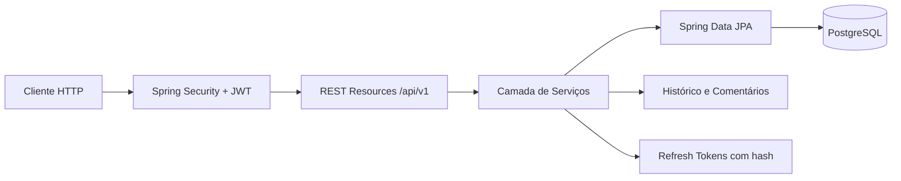
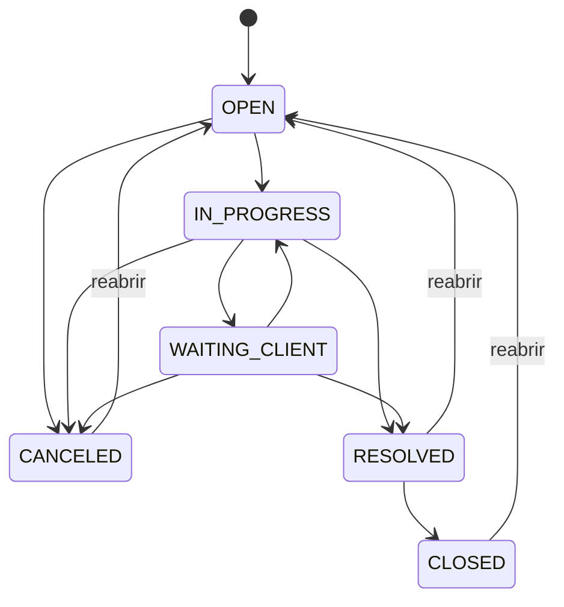

# Helpdesk API

API REST para gerenciamento de tickets de suporte, construída com Java, Spring Boot e PostgreSQL. O projeto demonstra autenticação JWT, autorização por perfil, refresh tokens rotativos, histórico auditável, comentários, filtros dinâmicos, paginação, documentação OpenAPI e execução com Docker.

## Funcionalidades

- Cadastro e autenticação de usuários.
- Access token JWT e refresh token rotativo.
- Logout com revogação do refresh token.
- Autorização por perfis `ROLE_USER` e `ROLE_ADMIN`.
- Criação e acompanhamento de tickets.
- Atribuição de atendentes.
- Ciclo de status com transições validadas.
- Reabertura de tickets.
- Comentários e histórico cronológico.
- Paginação, ordenação e filtros combináveis.
- Respostas de erro padronizadas.
- Swagger UI com suporte a Bearer Token.
- Ambiente completo com Docker Compose.

## Tecnologias

- Java 25
- Spring Boot 4
- Spring Security
- Spring Data JPA
- Flyway
- PostgreSQL 18
- JWT
- Springdoc OpenAPI
- Maven
- Docker e Docker Compose
- JUnit 5 e Mockito

## Arquitetura



O projeto segue uma separação em:

- `resources`: controllers e contratos HTTP;
- `services`: regras de negócio e autorização contextual;
- `repositories`: persistência e Specifications;
- `entities`: modelo relacional;
- `dto`: objetos de entrada e saída;
- `config`: segurança, OpenAPI e bootstrap do administrador.

## Regras de acesso

| Operação | ROLE_USER | ROLE_ADMIN |
|---|---:|---:|
| Abrir ticket | Sim | Não |
| Consultar os próprios tickets | Sim | Sim |
| Consultar todos os tickets | Não | Sim |
| Atribuir atendente | Não | Sim |
| Gerenciar usuários | Não | Sim |
| Comentar em ticket acessível | Sim | Sim |
| Consultar histórico acessível | Sim | Sim |

Usuários comuns só conseguem consultar os próprios tickets, mesmo que tentem enviar outro `clientId` nos filtros.

## Ciclo do ticket



## Executando com Docker

### Pré-requisitos

- Docker
- Docker Compose

### 1. Configure o ambiente

```bash
cp .env.example .env
```

Edite o `.env` e substitua principalmente:

```dotenv
POSTGRES_PASSWORD=uma-senha-segura
JWT_SECRET=uma-chave-longa-e-aleatoria-com-pelo-menos-32-caracteres
APP_ADMIN_PASSWORD=uma-senha-segura-para-o-admin
```

O arquivo `.env` é ignorado pelo Git.

### 2. Suba a aplicação

```bash
docker compose up --build -d
```

### 3. Acompanhe os logs

```bash
docker compose logs -f api
```

### 4. Encerre os containers

```bash
docker compose down
```

Para remover também os dados do PostgreSQL:

```bash
docker compose down -v
```

## URLs

| Recurso | URL |
|---|---|
| API | `http://localhost:8080/api/v1` |
| Swagger UI | `http://localhost:8080/swagger-ui.html` |
| OpenAPI JSON | `http://localhost:8080/v3/api-docs` |
| Actuator | `http://localhost:8080/actuator` |

## Administrador inicial

No perfil Docker, um administrador é criado na primeira inicialização quando:

```dotenv
APP_ADMIN_ENABLED=true
```

As credenciais são definidas por:

```dotenv
APP_ADMIN_NAME=Portfolio Admin
APP_ADMIN_EMAIL=admin@helpdesk.local
APP_ADMIN_PASSWORD=sua-senha
```

O bootstrap é idempotente: se o e-mail já existir, nenhum usuário duplicado será criado.

## Executando localmente

Com PostgreSQL disponível conforme `application-dev.properties`:

```bash
./mvnw spring-boot:run
```

Para executar os testes:

```bash
./mvnw test
```

## Versionamento do banco

O schema é gerenciado pelo Flyway. As migrations ficam em:

```text
src/main/resources/db/migration
```

A migration inicial é:

```text
V1__create_initial_schema.sql
```

O Hibernate está configurado com `ddl-auto=validate`: ele apenas verifica se as entidades estão compatíveis com o schema, sem criar ou alterar tabelas.

Para mudanças futuras, não edite uma migration já aplicada. Crie uma nova versão:

```text
V2__add_ticket_attachment.sql
V3__create_sla_policy.sql
```

O Flyway executa automaticamente as migrations pendentes durante a inicialização da aplicação.

## Autenticação

### Cadastro público

O cadastro público sempre cria um usuário `ROLE_USER`.

```http
POST /api/v1/auth/register
Content-Type: application/json
```

```json
{
  "name": "Maria Silva",
  "email": "maria@email.com",
  "password": "123456"
}
```

### Login

```http
POST /api/v1/auth/login
Content-Type: application/json
```

```json
{
  "email": "maria@email.com",
  "password": "123456"
}
```

Resposta:

```json
{
  "accessToken": "eyJ...",
  "refreshToken": "token-opaco",
  "tokenType": "Bearer",
  "expiresIn": 900
}
```

Use o access token nos endpoints protegidos:

```http
Authorization: Bearer eyJ...
```

### Renovação e logout

```http
POST /api/v1/auth/refresh
POST /api/v1/auth/logout
```

```json
{
  "refreshToken": "token-opaco"
}
```

Cada renovação revoga o refresh token anterior e emite um novo.

## Exemplos de tickets

### Abrir ticket

```http
POST /api/v1/tickets
Authorization: Bearer ACCESS_TOKEN
Content-Type: application/json
```

```json
{
  "title": "Erro ao acessar o sistema",
  "description": "Não consigo acessar o painel com minhas credenciais.",
  "priority": "HIGH"
}
```

O cliente é obtido do usuário autenticado; não existe `clientId` no body.

### Listar, paginar e filtrar

```http
GET /api/v1/tickets?page=0&size=20&status=OPEN&priority=HIGH&search=sistema&sort=createdAt,desc
Authorization: Bearer ACCESS_TOKEN
```

Filtros disponíveis:

- `status`
- `priority`
- `clientId`
- `attendantId`
- `search`, aplicado ao título e descrição
- `page`
- `size`
- `sort`

### Atribuir atendente

Requer `ROLE_ADMIN`.

```http
PUT /api/v1/tickets/1/assign
Authorization: Bearer ADMIN_ACCESS_TOKEN
Content-Type: application/json
```

```json
{
  "attendantId": 2
}
```

### Atualizar status

```http
PATCH /api/v1/tickets/1/status
Authorization: Bearer ACCESS_TOKEN
Content-Type: application/json
```

```json
{
  "status": "RESOLVED"
}
```

Status disponíveis:

- `OPEN`
- `IN_PROGRESS`
- `WAITING_CLIENT`
- `RESOLVED`
- `CLOSED`
- `CANCELED`

### Reabrir ticket

```http
POST /api/v1/tickets/1/reopen
Authorization: Bearer ACCESS_TOKEN
```

### Adicionar comentário

```http
POST /api/v1/tickets/1/comments
Authorization: Bearer ACCESS_TOKEN
Content-Type: application/json
```

```json
{
  "content": "O problema continua acontecendo após limpar o cache."
}
```

### Consultar comentários e histórico

```http
GET /api/v1/tickets/1/comments
GET /api/v1/tickets/1/history
Authorization: Bearer ACCESS_TOKEN
```

## Principais endpoints

| Método | Endpoint | Descrição |
|---|---|---|
| POST | `/api/v1/auth/register` | Cadastro público |
| POST | `/api/v1/auth/login` | Login |
| POST | `/api/v1/auth/refresh` | Renovação dos tokens |
| POST | `/api/v1/auth/logout` | Revogação do refresh token |
| GET | `/api/v1/tickets` | Listagem paginada e filtrada |
| POST | `/api/v1/tickets` | Abertura de ticket |
| GET | `/api/v1/tickets/{id}` | Consulta por ID |
| PUT | `/api/v1/tickets/{id}/assign` | Atribuição de atendente |
| PATCH | `/api/v1/tickets/{id}/status` | Atualização de status |
| POST | `/api/v1/tickets/{id}/reopen` | Reabertura |
| POST | `/api/v1/tickets/{id}/comments` | Novo comentário |
| GET | `/api/v1/tickets/{id}/comments` | Comentários |
| GET | `/api/v1/tickets/{id}/history` | Histórico |
| GET | `/api/v1/users` | Listagem administrativa |
| POST | `/api/v1/users` | Criação administrativa |

## Tratamento de erros

Os erros seguem um formato consistente:

```json
{
  "timestamp": "2026-06-21T12:00:00Z",
  "status": 422,
  "error": "Unprocessable Entity",
  "code": "TICKET_STATUS_TRANSITION_NOT_ALLOWED",
  "message": "A transição de OPEN para CLOSED não é permitida.",
  "path": "/api/v1/tickets/1/status",
  "validationErrors": []
}
```

## Estrutura do projeto

```text
src/main/java/com/paulo/helpdesk_api_java
├── config
├── dto
├── entities
├── repositories
├── resources
└── services
```

## Testes

A suíte atual cobre:

- regras de acesso aos tickets;
- transições de status;
- reabertura;
- cadastro público sem elevação de privilégio;
- rotação e revogação de refresh tokens;
- carregamento do contexto Spring com PostgreSQL.

```bash
./mvnw test
```

## Melhorias futuras

- Testes de integração com Testcontainers.
- Upload de anexos.
- SLA e notificações.
- Métricas com Prometheus e Grafana.
- Pipeline de CI/CD com GitHub Actions.

## Licença

Este projeto está disponível sob a licença MIT.
